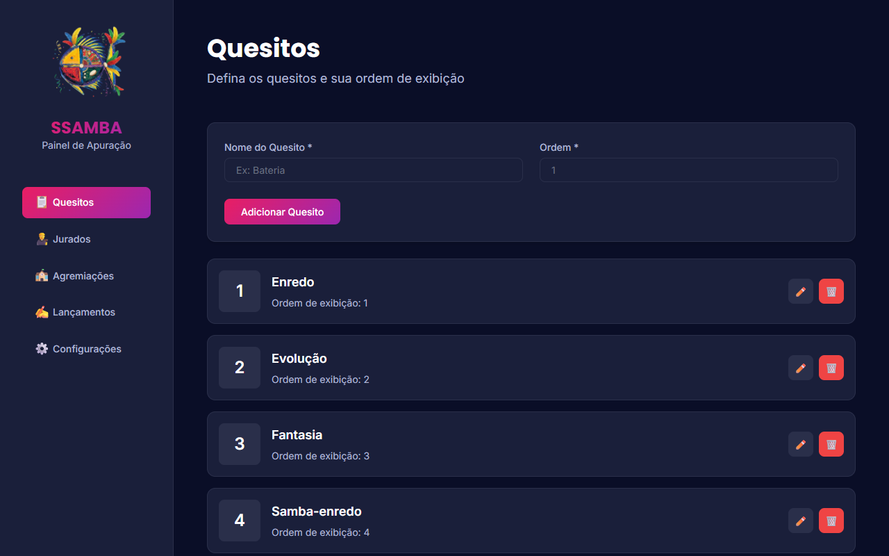
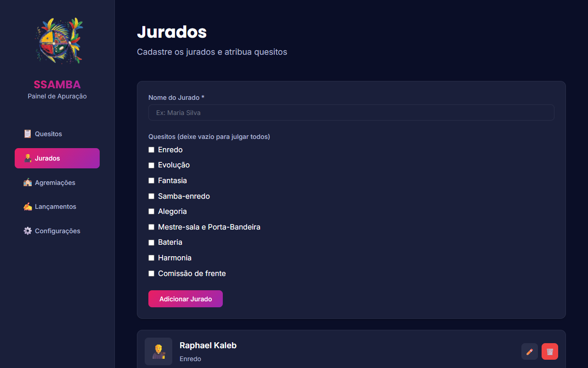
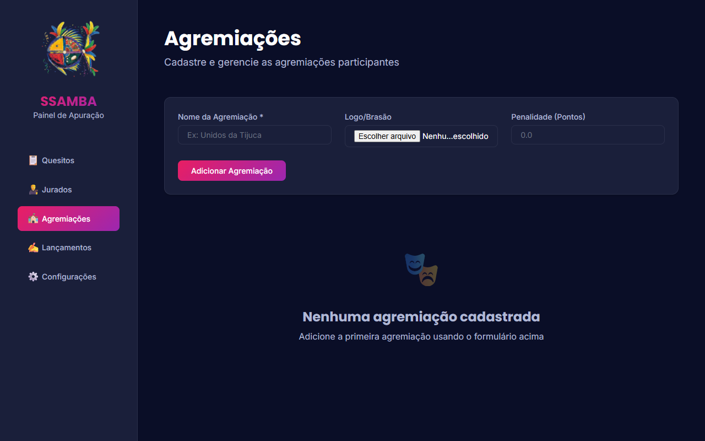
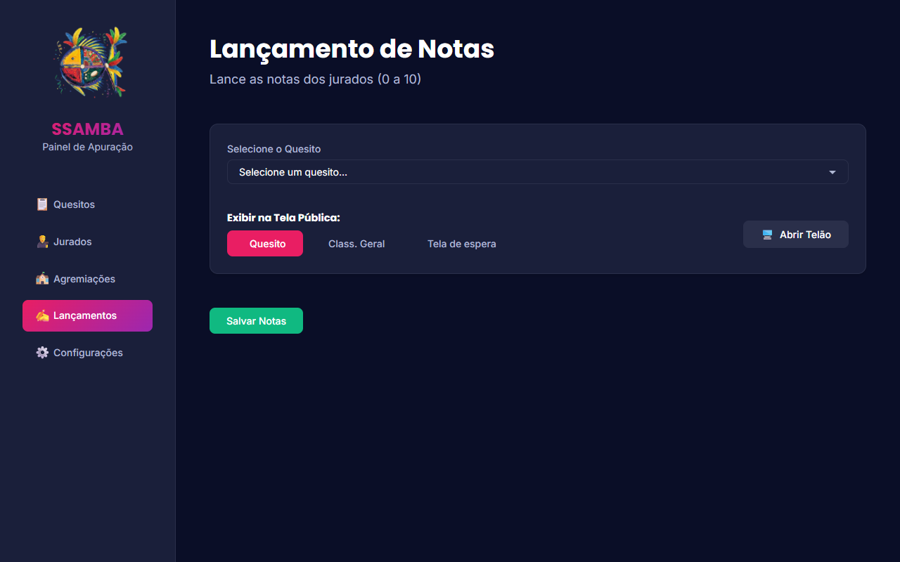
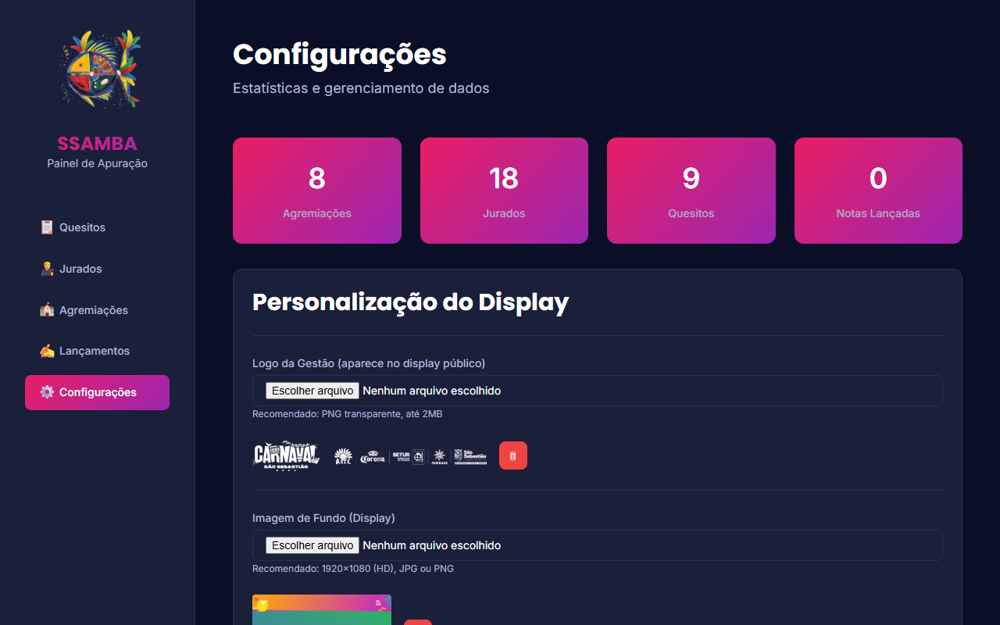

# 🎭 SSAMBA - Manual do Usuário

Bem-vindo ao **SSAMBA**, o sistema profissional de apuração de notas para escolas de samba. Este manual foi desenhado para guiar você passo a passo, desde a configuração inicial até a impressão do relatório final.

---

## 🚀 1. Iniciando o Sistema

Antes de tudo, certifique-se de que o servidor está rodando.

1.  Dê dois cliques no arquivo `iniciar_servidor.bat` na Área de Trabalho.
2.  Uma janela preta irá abrir. **Não feche essa janela**, ela é o coração do sistema.
3.  O painel abrirá automaticamente no seu navegador. Se não abrir, digite: `http://localhost:3000`

---

## 🔌 2. Conectando o Telão (Importante!)

Você tem duas formas de usar o sistema: **Local (Cabo)** ou **Remoto (Wi-Fi)**.

### Opção A: Cabo HDMI (Recomendado)
A forma mais simples e segura.
1.  Conecte o notebook à TV/Projetor com um cabo HDMI.
2.  No Windows, aperte `Teclado do Windows + P` e escolha **Estender**.
3.  No painel de Lançamentos, clique em **🖥️ Abrir Telão**.
4.  Uma nova janela abrirá. Arraste-a para a tela da TV e aperte `F11` para ficar em tela cheia.

### Opção B: Via Rede (Wi-Fi)
Se a TV for Smart e estiver **na mesma rede Wi-Fi** que o notebook:
1.  Olhe para a **janela preta do servidor** (aquela que abriu no início).
2.  Lá vai aparecer algo como: `📡 Acesso na Rede: http://192.168.0.15:3000`.
3.  Abra o navegador da TV e digite esse endereço exatamente igual.
    *   *Nota: O computador e a TV DEVEM estar conectados no mesmo roteador.*

---

## 🛠️ 3. Configuração Inicial (Preparação)

Siga esta ordem exata para configurar o evento.

### Passo 1: Cadastrar Quesitos
Vá até a aba **📋 Quesitos**.
Aqui você define o que será julgado (ex: Bateria, Harmonia) e a ordem de leitura.

1.  Preencha o **Nome do Quesito**.
2.  Defina a **Ordem** (1, 2, 3...).
3.  Clique em **Adicionar**.
    *   *Dica: A ordem define a sequência de leitura das notas.*

### Passo 2: Cadastrar Jurados
Vá até a aba **👨‍⚖️ Jurados**.

1.  Insira o **Nome do Jurado**.
2.  (Opcional) Selecione quais Quesitos ele julga. Se deixar vazio, ele julgará todos.
3.  Clique em **Adicionar**.

### Passo 3: Cadastrar Agremiações
Vá até a aba **🏫 Agremiações**.

1.  Coloque o **Nome da Escola**.
2.  (Recomendado) Escolha o **Logo/Brasão** da escola.
3.  Se houver punição inicial, insira em **Penalidade**.
4.  Clique em **Adicionar**.

---

## 🖥️ 4. Operação (Durante a Apuração)

Esta é a tela que você usará durante todo o evento. Vá para a aba **✍️ Lançamentos**.

### O Painel de Controle
No topo da tela de Lançamentos, você tem o controle total:
*   **Selecione o Quesito:** Escolha qual quesito está sendo lido agora. A tabela abaixo muda automaticamente.
*   **Botões de Visualização (O que aparece no telão):**
    *   `📋 Quesito`: Mostra as notas do quesito atual (Use durante a leitura).
    *   `🔢 Class. Geral`: Mostra o ranking atualizado (Use nos intervalos).
    *   `🖼️ Tela de espera`: Mostra o logo do evento (Use antes de começar ou no final).
*   **🖥️ Abrir Telão:** Clique aqui para abrir a janela do projetor. Arraste essa janela para o telão/TV externa.

### Lançando Notas
1.  Na tabela, localize a escola (linha) e o jurado (coluna).
2.  Digite a nota (ex: `9.8`, `10`). O sistema aceita ponto ou vírgula.
3.  **Aperte ENTER** ou clique fora. A nota fica verde (salva).
4.  Se errar, basta clicar e digitar novamente.
    *   *Nota:* O sistema calcula automaticamente o "Parcial" (soma do quesito) e o "Total" (soma geral).

---

## 📺 5. O Telão Público

O público verá uma interface limpa e animada.

*   **Animações:** Quando você muda/salva uma nota, ela pisca no telão.
*   **Líder:** A escola que estiver em 1º lugar fica destacada (piscando) na virada de notas.
*   **Personalização:** Na aba **⚙️ Configurações**, você pode mudar o Logo e o Fundo do telão.

---

## 📊 6. Relatórios e Finalização

Ao terminar a apuração:

1.  Vá em **⚙️ Configurações**.
2.  Clique em **📄 Gerar Relatório de Transparência**.
3.  Uma versão pronta para impressão abrirá, com todas as notas detalhadas e assinaturas.
4.  Use `Ctrl + P` para salvar como PDF ou imprimir.

---

## ❓ 7. Problemas Comuns e Soluções

| Problema | Possível Causa | Solução |
| :--- | :--- | :--- |
| **TV não conecta no servidor** | Firewalls ou redes diferentes. | Certifique-se que o PC e a TV estão no **mesmo Wi-Fi**. Se não funcionar, use o **Cabo HDMI** (Opção A). |
| **Endereço da rede não aparece** | Servidor antigo ou erro. | Abra o `iniciar_servidor.bat` novamente e procure por `Acesso na Rede`. |
| **Telão não abre** | Bloqueador de pop-ups. | Olhe na barra de endereço (ícone de x) e permita pop-ups para este site. |
| **Nota errada lançada** | Erro de digitação. | Volte na célula errada, digite a nova nota e dê ENTER. O sistema corrige automaticamente. |
| **Sistema travou** | Servidor fechado. | Verifique se a janela preta do servidor está aberta. Reabra se necessário. Nada será perdido. |
| **Contraste ruim no telão** | Imagem de fundo muito clara. | Em Configurações, troque o fundo por uma imagem mais escura para as letras brancas aparecerem bem. |

---

> **Dica de Ouro:** Teste a conexão com a TV **antes** do evento começar. Se usar Wi-Fi, cuidado com oscilações. Cabo HDMI é sempre mais seguro!

**Bom trabalho e bom carnaval! 🎉**
